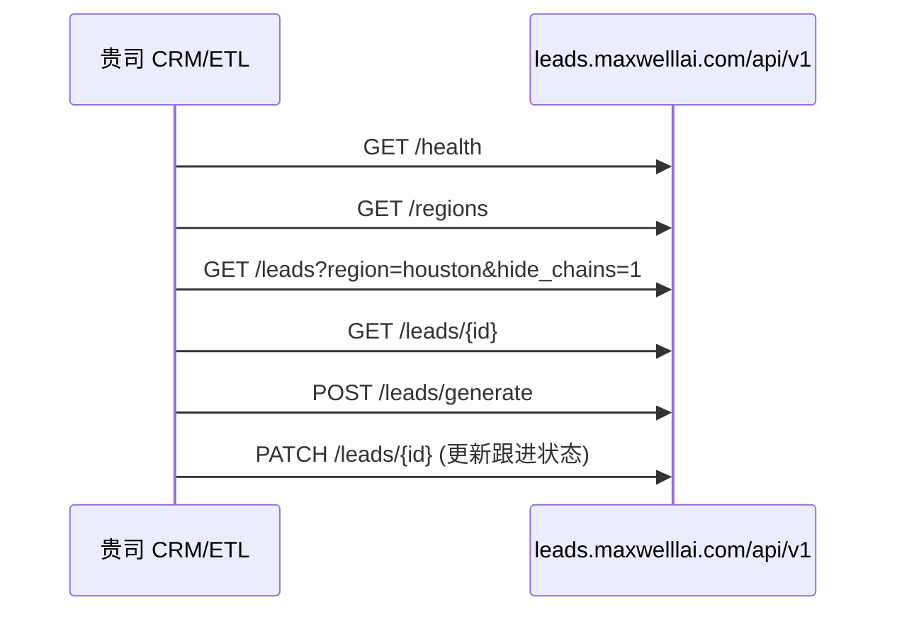

# Restaurant Leads Finder — API 接入说明

**产品名称**：Restaurant Leads Finder（餐饮新店线索平台）  
**API 版本**：v1  
**生产环境 Base URL**：`https://leads.maxwelllai.com/api/v1`

API Key 由我方运营单独发放，**勿写入代码仓库或本文档**。

所有接口返回 JSON，UTF-8 编码。

---

## 1. 鉴权

每个 HTTP 请求须携带 API Key（由我方运营发放，请勿写入客户端代码仓库或提交到 Git）。

**方式一（推荐）**

```http
Authorization: Bearer {YOUR_API_KEY}
```

**方式二**

```http
X-API-Key: {YOUR_API_KEY}
```

| HTTP 状态码 | 含义 |
|-------------|------|
| 401 | Key 无效或缺失 |
| 403 | Key 有效但权限不足（写操作需 write 权限） |
| 503 | 服务端未配置 API（请联系我方） |

成功响应均包含字段：`"api_version": "v1"`。

---

## 2. 通用约定

- **Content-Type**：`application/json`（POST/PATCH 请求体）
- **时间**：日期字段为 ISO 8601（如 `2025-03-15`）；时间戳为 UTC
- **分页**：列表接口使用 `page`（从 1 开始）、`limit`（默认 25，最大 100）
- **地区 `region`**：`all` | `sf_bay` | `la` | `nyc` | `chicago` | `houston` | `seattle` | `austin` | `boston` 等（与网页筛选一致）
- **线索状态 `lead_status`**：`new` | `contacted` | `qualified` | `won` | `lost`

---

## 3. 接口列表

### 3.1 健康检查

```http
GET /health
```

**响应示例**

```json
{
  "api_version": "v1",
  "ok": true,
  "service": "restaurant-leads-finder",
  "configured": true
}
```

---

### 3.2 地区列表

与网页「地区」下拉一致。

```http
GET /regions
```

**响应字段**：`regions[]` — 含 `id`、`label`、`shortLabel`、`openDataUrl`、`importHint`

---

### 3.3 线索列表

```http
GET /leads
```

**查询参数**

| 参数 | 类型 | 说明 |
|------|------|------|
| page | int | 页码，默认 1 |
| limit | int | 每页条数，默认 25，最大 100 |
| region | string | 都会区，默认行为同网页 |
| city | string | 城市（支持地址解析匹配） |
| status | string | 线索状态 |
| cuisine_type | string | 菜系模糊匹配 |
| min_score | int | 最低线索分 |
| min_confidence | float | 最低餐厅置信度 |
| chinese_only | bool | `1` 或 `true` 仅中餐标签 |
| hide_chains | bool | `1` 或 `true` 隐藏连锁 |
| search | string | 店名/地址关键词 |
| date_from / date_to | date | 牌照日期范围 |
| sort | string | 排序字段，默认 `lead_score` |
| order | string | `asc` 或 `desc` |

**响应示例**

```json
{
  "api_version": "v1",
  "data": [
    {
      "id": "uuid",
      "name": "Example Bistro",
      "address": "123 Main St, Houston, TX 77002",
      "city": "Houston",
      "metro_area": "houston",
      "source": "houston_health_food_permit",
      "license_date": "2025-05-01",
      "lead_score": 85,
      "lead_status": "new",
      "cuisine_type": "American",
      "phone": null,
      "ai_classification": {},
      "created_at": "2025-05-02T12:00:00Z"
    }
  ],
  "pagination": {
    "page": 1,
    "limit": 25,
    "total": 1200,
    "totalPages": 48
  }
}
```

---

### 3.4 线索详情

```http
GET /leads/{id}
```

**响应要点**

- `lead`：完整线索对象（与列表字段一致，含 `source_raw`、`ai_classification` 等）
- `filing_portal`：该线索所在州政府备案门户配置（标题、外链、是否复制店名等）
- `links`：站内路径，便于贵司拼完整 URL  
  - `detail_path`：如 `/leads/{id}`  
  - `dashboard_business_search_path`：首页商业搜索深链  
  - `filing_portal_search_url`：州政府查询外链（如 TX SOSDirect）

**完整 URL 示例**：`https://leads.maxwelllai.com` + `detail_path`

---

### 3.5 更新线索

```http
PATCH /leads/{id}
```

**请求体（字段均可选，只更新传入字段）**

```json
{
  "lead_status": "contacted",
  "notes": "已电话跟进",
  "outreach_message": "自定义开发信文本"
}
```

**响应**：`{ "api_version": "v1", "lead": { ... } }`

---

### 3.6 政府备案时间线

```http
GET /leads/{id}/filings
```

**响应**：`{ "filings": [ { "id", "filing_type", "filed_date", "document_url", ... } ] }`

**追加备案**

```http
POST /leads/{id}/filings
```

```json
{
  "mode": "append",
  "filings": [
    {
      "filing_type": "Statement of Information",
      "filed_date": "2025-01-15",
      "document_url": "https://...",
      "control_id": "optional"
    }
  ]
}
```

`mode` 可选 `replace_ca_sos`（仅加州 SOS 全量替换，慎用）。

---

### 3.7 刷新联网开业情报（AI）

```http
POST /leads/{id}/opening-intel
```

无请求体。调用我方 Anthropic 联网分析，结果写入 `lead.ai_classification.opening_intel_web`。

**响应**：`opening_intel_web`、`lead`（更新后）

**可能错误**：503（未配置 AI）、502（模型解析异常）

---

### 3.8 生成 AI 开发信

```http
POST /leads/generate
```

```json
{
  "lead_id": "uuid"
}
```

**响应**：`outreach_message`、`lead`（已持久化到数据库）

---

### 3.9 城市列表（筛选器）

```http
GET /cities?region=houston&q=katy
```

| 参数 | 说明 |
|------|------|
| region | 都会区，默认 `all` |
| q | 城市名模糊搜索（可选） |

**响应**：`cities[]`、`scanned`、`region`

---

### 3.10 地图标点

```http
GET /map-markers
```

返回带经纬度的线索（来源于政府开放数据 `source_raw`，最多约 800 条高分线索）。

**响应**：`markers[]`（`id`, `name`, `lat`, `lng`, `lead_score`, ...）、`scanned`、`skipped_no_coords`

---

### 3.11 老板信息搜索（Whitepages Pro）

```http
POST /owner/search
```

```json
{
  "name": "John Smith",
  "region": "Houston, TX",
  "address": "123 Main St Houston TX",
  "keywords": "restaurant owner"
}
```

至少填写 **姓名、地区、地址** 之一；地址建议含街道。若提供 `keywords` 且配置了 AI，将自动做联网交叉验证。

**响应**：`results[]`、`keyword_analysis_applied`、`search_mode` 等

---

### 3.12 People Data Labs 人员搜索

```http
POST /pdl/search
```

```json
{
  "name": "Jane Doe",
  "region": "California",
  "company": "Example LLC"
}
```

至少一项 ≥2 字符。

---

### 3.13 证据链流水线（可选，需我方开启环境变量）

用于 n8n / CRM 自动化：**识别经营主体 → 地产验证 → 联系方式 → 交叉验证打分**。默认关闭，未开启时返回 `503`。

| 步骤 | 方法 | 路径 | 说明 |
|------|------|------|------|
| 1 识别 | POST | `/leads/{id}/identify` | 政府 `ownership_name` → 法人判断 → **CA SOS BE API**（加州）/ OpenCorporates（其他州）→ `owner_name` / `owner_entity` 证据 |
| 2 地产 | POST | `/property/lookup` | Body: `{ "leadId": "uuid" }` → `is_new_store` 等证据 |
| 3 联系方式 | POST | `/leads/{id}/enrich` 或 `/owner/search` | 见下方 Provider 说明 |
| 4 打分 | POST | `/leads/{id}/cross-validate` | 汇总证据 → `lead_contacts` + `store_status` |

**生产推荐 Provider（无需 ATTOM / BatchData）**

| 能力 | 环境变量 | 推荐值 | 说明 |
|------|----------|--------|------|
| 地产 | `PROPERTY_PROVIDER` | `government` | 读线索 `source_raw` 中政府 permit/牌照字段，零 API 费 |
| 联系方式 | `SKIP_TRACE_PROVIDER` | `whitepages` | 复用 `WHITEPAGES_PRO_API_KEY`，与 `/owner/search` 同源 |
| 试跑 | 同上 | `mock` | 无账单、固定 fixture |

可选付费替代：`PROPERTY_PROVIDER=attom`（ATTOM）、`SKIP_TRACE_PROVIDER=batchdata`（BatchData）。

**推荐 n8n 顺序（自动化）**

```
POST /api/leads/upsert
  → POST …/identify
  → POST …/property/lookup
  → POST …/enrich          # SKIP_TRACE_PROVIDER=whitepages
  → POST …/cross-validate
```

**推荐人工/半自动顺序（销售在仪表盘或 CRM 触发）**

```
GET  …/leads/{id}                    # 取店名、地址、source_raw（预填搜索）
  → POST …/owner/search              # Whitepages + 可选 AI 关键字交叉验证
  → POST …/leads/{id}/persist-owner-search   # 写 lead_evidence；默认再跑 cross-validate
```

`persist-owner-search` 成功后一般**不必**再单独调 `cross-validate`（body 默认 `runCrossValidate: true`）。

#### DataSF → CA SOS / 企业登记 API（`identify` 步骤 1）

适用于 SF Bay / 其他政府源在 `source_raw.ownership_name` 给出**法人实体**（如 `Pangea Management LLC`、`Original Buffalo Wings Inc.`），而 DBA 店名在 `name` 字段的场景。

**链路（代码：`lib/ca-sos/be-public-search.ts`、`lib/identity/collect-hits.ts`）**

```
source_raw.ownership_name
  → 规则判断：公司 vs 自然人（lib/identity/entity-kind.ts）
  → 加州（sf_bay / la）：
      CA SOS BE Public Search API（calico.sos.ca.gov）
      · 有 ca_entity_number → GET BusinessEntityDetails
      · 否则 → GET BusinessEntityKeywordSearch
      · 一手字段：EntityName、AgentName、ManagementDescription
      · 证据 source = ca_sos
  → 其他州：OpenCorporates API；无 officer 时可 Tavily 联网补全
  → 政府法人 + 登记 API 同实体 → registry chain 锁定 owner_person_name
  → Whitepages 只搜自然人姓名（非 LLC 名）
```

**CA SOS 配置**

1. [https://calicodev.sos.ca.gov](https://calicodev.sos.ca.gov) 注册 → Products → Subscribe  
2. 复制 **Ocp-Apim-Subscription-Key** → `CA_SOS_BE_SUBSCRIPTION_KEY`  
3. 生产：`https://calico.sos.ca.gov/cbc/v1/api`；UAT：`CA_SOS_BE_UAT=1`

**证据 `raw_payload` 标记**

| `lookup` | 含义 |
|----------|------|
| `ca_sos_api` | 加州 SOS BE API 命中 |
| `api` | OpenCorporates（非加州） |
| `api+web_search` | OC 无 officer，Tavily 联网补全 |

**环境变量**

| 变量 | 必需 | 说明 |
|------|------|------|
| `CA_SOS_BE_SUBSCRIPTION_KEY` | 加州推荐 | SOS BE API（一手政府数据） |
| `OPENCORPORATES_API_TOKEN` | 非加州 | TX/NY 等回退 |
| `TAVILY_API_KEY` | OC 联网回退 | 仅 OpenCorporates 路径 |

**生产案例（SF）**：`Dumpling Patio` — `ownership_name` = `Original Buffalo Wings Inc.` → CA SOS 得 Agent/高管 → Whitepages 搜自然人。

#### 何时用半自动，而非全自动 `enrich`

| 场景 | 建议路径 |
|------|----------|
| `identify` 未锁定自然人老板（`ownerResolutionStatus: review`） | **半自动** `owner/search` → `persist-owner-search` |
| 店名是 DBA/LLC，直接 `enrich` 会把店名当自然人搜 | **半自动**（地址 + `keywords` = 店名） |
| 已有多源一致的 `owner_person_name` | 可全自动 `enrich` → `cross-validate` |

生产验证（2026-06）：Houston 线索 **MARIA'S RESTAURANT**（税号主体 `MONA ITALIAN FOOD LLC`）上，全自动 `enrich` 拉回 16 条联系方式但 cross-validate **全部 discarded**；半自动路径写入 **26** 条证据并最终入库 **2** 条休斯顿区号电话（`lead_contacts`，status `review`，待销售确认）。

#### 半自动 SOP（API 逐步）

**0. 预填搜索条件**（与仪表盘「老板信息搜索」一致，见 `lib/lead-owner-search-defaults.ts`）

- `name`：自然人老板（`identify` 或 `owner_person_name` 锁定后）；**不要**填 `ownership_name` 法人  
- `entityName`：政府 `ownership_name` / `owner_entity_name`（供 CA SOS / 登记 API 交叉验证）  
- `caEntityNumber`：线索 `ca_entity_number`（有则直达 CA SOS BusinessEntityDetails）  
- `region`：`{city}, {state}`（地址无州时仅 city，建议 CRM 补全 `, TX`）  
- `address`：线索 `address`  
- `keywords`：线索 `name`（DBA），用于 AI 交叉验证过滤候选

**1. 老板搜索**

```http
POST /owner/search
Authorization: Bearer {API_V1_KEY}
Content-Type: application/json
```

```json
{
  "name": "",
  "entityName": "MONA ITALIAN FOOD LLC",
  "region": "HOUSTON, TX",
  "address": "500 DALLAS ST STE T20B",
  "keywords": "MARIA'S RESTAURANT"
}
```

需 `WHITEPAGES_PRO_API_KEY`；`keywords` ≥2 字符且配置了 `ANTHROPIC_API_KEY` 时返回 `keyword_analysis_applied: true` 与 `analyses`（按候选人 `id` 索引）。

**2. 证据入库 + 打分**

```http
POST /leads/{id}/persist-owner-search
```

```json
{
  "results": [ "... Whitepages 响应中的 results 数组原样传入 ..." ],
  "analyses": { "... 可选，来自 owner/search 的 analyses ..." },
  "keyword_analysis_applied": true,
  "runCrossValidate": true
}
```

需 `ENABLE_LEAD_EVIDENCE_WRITE=1` 与 `ENABLE_LEAD_EVIDENCE_CROSS_VALIDATE=1`。响应含 `evidenceInserted` 与 `crossValidate`（`contactsUpserted`、`storeStatus` 等）。

**3. 人工确认（销售）**

- 在仪表盘核对 `lead_contacts` 中 status 为 `review` 的号码/邮箱  
- 确认老板后可在 UI 备注，或通过 `PATCH /leads/{id}` 更新 `notes` / `lead_status`  
- 成交/无意向可写 `lead_outcomes`（`ENABLE_LEAD_FEEDBACK=1`）

#### 路径对照

| 能力 | 浏览器 Session | API v1 |
|------|----------------|--------|
| 识别 / 地产 / enrich / 打分 | `/api/leads/identify` 等，body `{ "leadId": "uuid" }` | `/api/v1/leads/:id/identify` 等 |
| 老板搜索 | `/api/owner/search` | `/api/v1/owner/search` |
| 搜索入库 | `/api/leads/{id}/persist-owner-search` | `/api/v1/leads/:id/persist-owner-search` |
| 地产 lookup | `/api/property/lookup` | `/api/v1/property/lookup` |

n8n/CRM 请使用 **v1 + `API_V1_KEY`**（`Authorization: Bearer` 或 `X-API-Key`）。若 `GET /health` 返回「无效的 API Key」，请在 Vercel Production 检查 `API_V1_KEY` 是否已配置非空值。

---

## 4. 典型对接流程



1. 定时拉取 `GET /leads`（按 `region`、`date_from` 增量）  
2. 对高分配线索 `GET /leads/{id}` 取详情与 `filing_portal` 外链  
3. 需要时 `POST /leads/generate` 生成开发信  
4. CRM 跟进后 `PATCH /leads/{id}` 回写 `lead_status` / `notes`

---

## 5. cURL 示例

```bash
export BASE="https://leads.maxwelllai.com/api/v1"
export KEY="{YOUR_API_KEY}"

# 健康检查
curl -s -H "Authorization: Bearer $KEY" "$BASE/health" | jq .

# 休斯顿高分新店（隐藏连锁）
curl -s -H "Authorization: Bearer $KEY" \
  "$BASE/leads?region=houston&min_score=70&hide_chains=1&limit=10" | jq .

# 详情
curl -s -H "Authorization: Bearer $KEY" \
  "$BASE/leads/LEAD_UUID_HERE" | jq .

# 生成开发信
curl -s -X POST -H "Authorization: Bearer $KEY" -H "Content-Type: application/json" \
  -d '{"lead_id":"LEAD_UUID_HERE"}' \
  "$BASE/leads/generate" | jq .
```

---

## 6. 速率与限制

- 列表 `limit` 最大 **100**
- AI 类接口（`opening-intel`、`generate`、`owner/search`）耗时较长，建议客户端超时 ≥ **120s**
- 请避免高频轮询全量列表；推荐按 `region` + `date_from` 增量同步

---

## 7. 暂未开放 v1 的能力

以下仍通过网页登录或专用密钥：

| 能力 | 说明 |
|------|------|
| 批量数据源导入 | 网页「导入」或内部 Cron |
| HubSpot 导出 | 网页操作 |
| n8n 线索推送 | `POST /api/leads/upsert` + `x-webhook-secret`（非 API v1 Key） |

---


*文档版本：2026-06-05 · API v1（§3.13 补充 AI 联网 OpenCorporates 高管检索 + 半自动老板搜索 SOP）*
